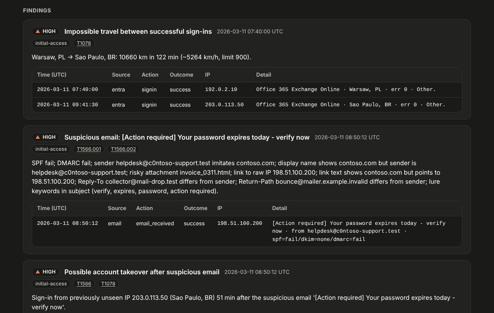
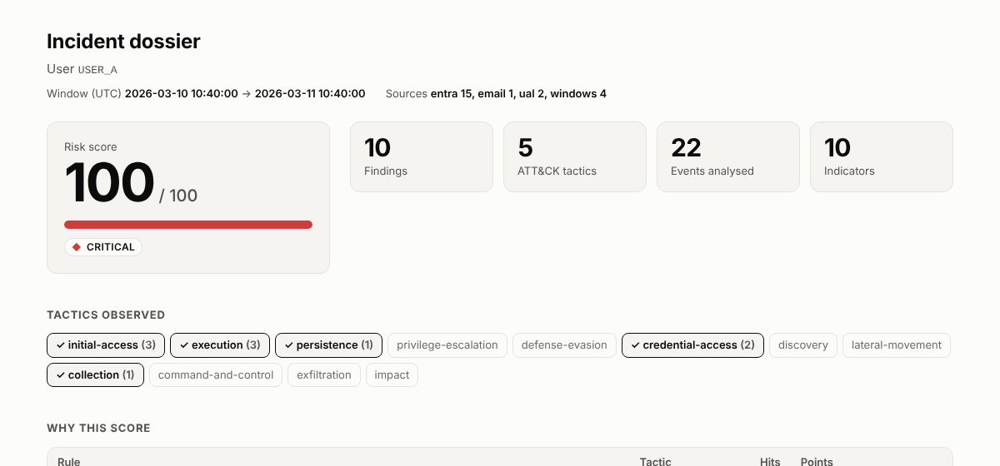

# HunterScope

Identity-centric triage for SOC L1/L2: give it a **user** or **host** and a **time range**, get an
investigation dossier with correlated detections, an **explainable risk score**, MITRE ATT&CK mapping,
extracted IOCs, a timeline, and an optional **pseudonymized** export that is safe to paste into a ticket.

Works fully offline on JSON/NDJSON exports (Entra ID sign-ins, M365 Unified Audit Log, Windows/Sysmon) and `.eml`
files. `-i` accepts files or whole directories.

```
logs (json/ndjson) -> ingest (normalize to Event) -> detect (stateful rules) -> score (explainable)
                                                                         \-> report (Jinja2 md/json) -> redact (optional)
```

## Quick start

```bash
pip install -e ".[dev]"
python scripts/generate_samples.py           # synthetic data, already committed
S=data/samples
hunterscope triage -i $S -u jkowalski -t 24h              # whole directory: logs + emails
hunterscope triage -i $S -u jkowalski --redact -o ticket.md      # safe to share
hunterscope triage -i $S -H ws-jkowalski                         # host view
hunterscope rules                                              # rules + MITRE mapping
pytest -q
```

`--anchor latest` (default) ends the window at the target's newest event, which is what you want for exported
data; use `--anchor now` against live exports.

## Reports

Every dossier and handover can be rendered as Markdown (for tickets), JSON, or a **standalone HTML** file:

```bash
hunterscope triage -i $S -u jkowalski -f html -o dossier.html
hunterscope triage -i $S -u jkowalski -f html --redact -o dossier-shareable.html
hunterscope shift-summary -f html -o handover.html
```







Open the generated examples in a browser: [`dossier-jkowalski.html`](docs/examples/dossier-jkowalski.html),
[`dossier-jkowalski-redacted.html`](docs/examples/dossier-jkowalski-redacted.html),
[`handover.html`](docs/examples/handover.html) (synthetic data; download first, GitHub shows source).

Design decisions:
- **No JavaScript and no external requests**, enforced by a `Content-Security-Policy` of `default-src 'none'`. The
  file is safe to attach to a ticket or email and works offline. Print it from the browser for a PDF.
- **Log content is untrusted.** Command lines, subjects and sender names go through Jinja autoescaping; tests feed
  `<script>` and `` payloads through every field.
- **Colour never carries meaning alone.** Severity is a status colour plus a distinct glyph and a text label; the
  risk score is a hero number with a meter and the exact value; the score breakdown is a table whose bars also print
  their points. Follows the OS light/dark setting and prints cleanly.
- The only links are to the MITRE ATT&CK technique pages.

Rebuild the examples and screenshots (deterministic, synthetic): `pip install -e ".[shots]"` then
`python scripts/build_screenshots.py`.

## Detections (stateful correlation; `src/hunterscope/config/rules.yaml`)

| Rule | Tactic | MITRE |
|---|---|---|
| failures_then_success | credential-access | T1110, T1078 |
| mfa_fatigue | credential-access | T1621 |
| impossible_travel | initial-access | T1078 |
| off_hours_login | initial-access | T1078 |
| suspicious_inbox_rule | collection | T1114.003, T1564.008 |
| oauth_consent | persistence | T1528 |
| lsass_access | credential-access | T1003.001 |
| lotl_commandline | execution | T1059 (+ per pattern: T1027, T1105, T1003.001, T1033, T1490, ...) |
| suspicious_email | initial-access | T1566.001, T1566.002 |
| phish_then_new_signin (meta rule) | initial-access | T1566, T1078 |

Thresholds, weights and patterns are YAML, overridable with `--config`. Every rule ships with positive **and**
benign tests (flight vs impossible travel, 4 vs 5 failures, `certutil -hashfile` vs `-urlcache`).

### Phishing triage

`.eml` is parsed with the stdlib (`email`, policy.default): SPF/DKIM/DMARC from `Authentication-Results`, origin IP from
the `Received` chain, anchor text vs. real `href`, attachments with SHA-256. Signals are split into **strong**
(auth failure, lookalike/punycode sender, display-name spoofing, risky or double-extension attachment, raw-IP link,
link text pointing elsewhere) and **weak** (Reply-To / Return-Path mismatch, shorteners, lure keywords). One strong
signal fires the rule; weak ones need three together, so a legitimate newsletter with a different Reply-To stays quiet.

The meta rule `phish_then_new_signin` correlates the verdict: a suspicious mail followed within 24 h by a successful
sign-in from an IP the user had never used before it. It stays silent without prior history (nothing to call "new").
URLs are defanged (`hxxp://198[.]51[.]100[.]200/login`) in the IOC list.

## Cases and shift handover

`--save` records the triage in a local SQLite case DB (`$HUNTERSCOPE_DB` or `~/.hunterscope/cases.db`, `--db` to
override). The same target (`jkowalski`, `jkowalski@contoso.com` and `CONTOSO\jkowalski` are one identity) keeps one
open case: re-triage updates its score and adds only findings it has not seen (content fingerprints), so running it
every hour does not duplicate anything.

```bash
hunterscope triage -i $S -u jkowalski --save
hunterscope case list                                   # open cases (--all for closed)
hunterscope case note 1 "Password reset forced, waiting for callback"
hunterscope case status 1 escalated_l2 -n "Inbox rule + OAuth consent confirmed, needs purge"
hunterscope case status 2 closed_fp  -n "Business trip WAW->LHR, 3 typos then success"
hunterscope case show 1                                 # findings + full audit log
hunterscope shift-summary --hours 12                    # rich tables in a terminal, Markdown when piped / -o
hunterscope shift-summary --redact -o handover.md       # safe to paste into a ticket
```

Rules that keep the handover trustworthy:
- Statuses: `new`, `in_progress`, `escalated_l2`, `escalated_l3`, `closed_fp`, `closed_tp`.
- **Closures and escalations require `--note`**: the next shift must be able to read *why*.
- **Closed cases are immutable.** A new triage of the same target opens a fresh case instead of silently reopening.
- Every note and status change is an append-only log entry with author and UTC time.
- Handover sections: unresolved (sorted by risk, `STALE` after 24 h without any touch), escalated (all still open,
  flagged if escalated this shift), and closed FP / TP from this shift with their reasons.

The case DB holds **real, un-redacted data**; it is git-ignored, single-writer and meant for a local disk, not a
network share. Redaction happens on output (`--redact`), never in storage.

## Measured coverage

`docs/coverage.md` is generated by running the rules against public, labelled datasets
([OTRF Security-Datasets](https://github.com/OTRF/Security-Datasets), 98 Windows datasets / ~752k events with
per-dataset ATT&CK labels; [EVTX-ATTACK-SAMPLES](https://github.com/sbousseaden/EVTX-ATTACK-SAMPLES), labelled by
tactic only).

**Method.** Datasets are split 50/50 by a fixed hash into *dev* and *holdout*. Rules are designed from dev
telemetry only; holdout is read only through the report. The split was fixed after the first all-data report had
been read, so holdout is held out from rule design, not blind.

| Step | Dev (52 datasets) | Holdout (46) |
|---|---|---|
| Baseline, command-line rules only (in-scope datasets hit) | 3 / 10 | 1 / 7 |
| + `lsass_access` (Sysmon 10, designed on dev) | 5 / 10 | 3 / 7 |

Read the counts, not the percentages: the 95% intervals are 24-76% (dev) and 16-75% (holdout), because only 17
datasets carry a technique we have a rule for. What the numbers do support: the rule's two newly detected holdout
datasets are both Mimikatz variants it was never tuned on, and the T1003.001 row is 5/5 (3 dev, 2 holdout).

**Cost, not hidden.** `lsass_access` produced 10 findings: 5 on dev (1 without a matching label) and 5 on holdout
(3 without one). "No matching label" is not automatically a false positive (the labs run ancillary tooling), but
those three holdout findings were deliberately **not** inspected so the holdout stays clean. No benign baseline
exists in these datasets, so precision is not measured. Looking at them would turn holdout into dev; do that only
when the rule design is frozen.

Other honest limits:
- HunterScope is identity/phishing triage with a thin Windows layer, not an EDR. Most labelled techniques (WMI,
  injection, scheduled tasks, SMB/RDP lateral movement) have no rule; `docs/coverage.md` lists every one.
- `lsass_access` needs Sysmon EventID 10 for lsass, which many production Sysmon configs filter out for volume.
  The allowlist in `rules.yaml` is a starting point to tune per environment, not a universal one.
- The cloud rules (Entra ID, M365, phishing) have no public labelled dataset here; they are covered by synthetic
  scenarios with documented outcomes.

Reproduce (needs `git`, ~260 MB; datasets go to git-ignored `data/external/`, never redistributed):

```bash
python scripts/fetch_datasets.py
pip install -e ".[bench]"
hunterscope coverage --otrf data/external/security-datasets --evtx data/external/evtx-attack-samples \
  --ablate lsass_access -o docs/coverage.md
```

## Score

Not a bare sum. First hit of a rule counts fully, repeats count 25%, one rule is capped at 2x its weight, and
activity across several ATT&CK tactics adds a bonus. The dossier lists every contribution, so an analyst can
see *why* a user has 73/100.

## Redaction

Single-pass, deterministic pseudonyms (`USER_A`, `INTERNAL_IP_1`, `HOST_2`); the same entity always gets the same
label, so the story stays readable. PESEL is matched only when the checksum is valid. With `--key-env VAR`
labels become HMAC-SHA256 tags: stable across runs and not reversible by brute-forcing small spaces (IPv4, PESEL).
`--mapping-out` writes label -> original and **contains the sensitive data**; keep it out of tickets.

Link URLs are kept as IOCs (like public IPs), but external *addresses* are masked.
Known limits: free-text names ("Jan Kowalski") are not detected; unknown short hostnames are not detected
(FQDNs are); public IPs are kept by default because they are IOCs, set `keep_public_ips: false`
(`--redactor-config`) before sharing outside the SOC. Your company's egress IP is public too.

## Data

`data/samples/` is synthetic and labelled as such. Do not commit real logs, and do not build this against
employer data.

## Roadmap

- [x] `.eml` phishing triage (SPF/DKIM/DMARC, defanged URLs, attachment hashes) feeding the same dossier
- [ ] URL reputation / sandbox enrichment (optional, off by default; offline mode must keep working)
- [x] SQLite case store + `--shift-summary` handover (statuses, notes, open anomalies; md + terminal)
- [x] ATT&CK coverage measured against public datasets (`docs/coverage.md`)
- [ ] Sigma rules via pySigma for stateless patterns, evaluated on a held-out split of the same datasets
- [x] Sysmon 10 (ProcessAccess to lsass): closed the largest measured gap (T1003.001), measured with a holdout
- [x] Standalone HTML report (dossier and handover)
- [ ] Live OpenSearch client (last, only after everything works offline)
