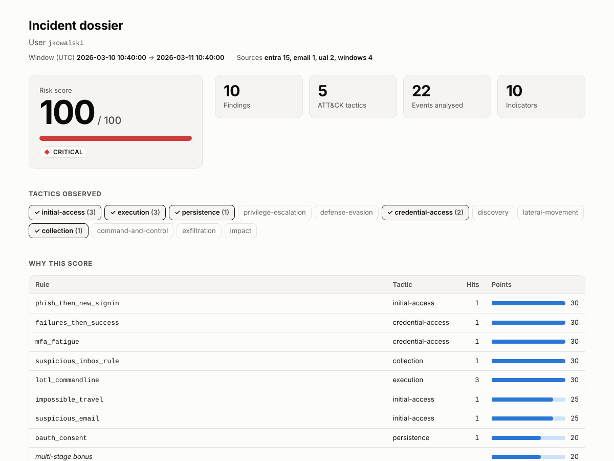
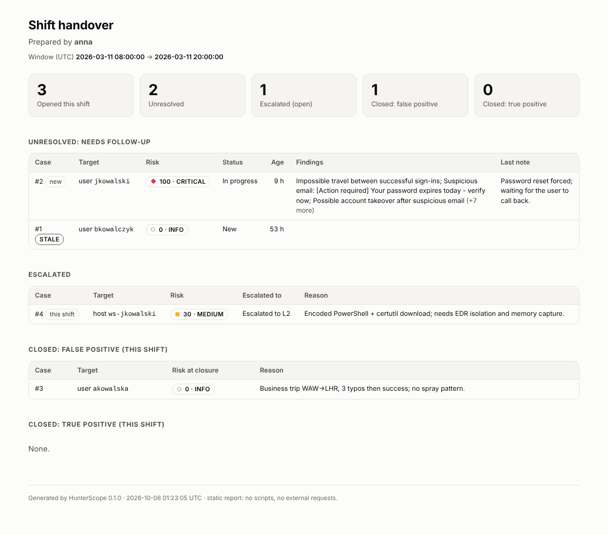

# HunterScope

[](https://github.com/barzim1/Hunterscope/actions/workflows/ci.yml)


**Identity-centric triage for SOC L1/L2.** Give it a user or a host and a time range; it returns an investigation
dossier: correlated detections mapped to MITRE ATT&CK, a risk score that shows its arithmetic, IOCs, a timeline,
and a pseudonymized export that is safe to paste into a ticket. A case store and a shift handover close the loop
between analysts.

It runs offline on log exports (Entra ID sign-ins, M365 audit log, Windows Security/Sysmon, `.eml` files), so it
can be demonstrated without a SIEM and without anyone's real data.



## Why it exists

The repetitive part of L1 work is the same every time: pull the user's sign-ins, check the mail they received,
look at what their host ran, decide, write it up, mask the personal data, hand over to the next shift. HunterScope
automates the pulling, correlating and writing, and leaves the decision (and its justification) to the analyst.

## Try it (about a minute)

```bash
git clone https://github.com/barzim1/Hunterscope.git && cd Hunterscope
python3 -m venv .venv && source .venv/bin/activate        # Windows: .venv\Scripts\activate
pip install -e .

hunterscope triage -i data/samples -u jkowalski                       # terminal dossier
hunterscope triage -i data/samples -u jkowalski -f html -o dossier.html    # standalone HTML report
hunterscope triage -i data/samples -u jkowalski --redact              # USER_A, EXT_EMAIL_1, ...
hunterscope rules                                                     # rules and their ATT&CK mapping
```

`data/samples` is synthetic: one account taken over through a phishing mail (password spraying, MFA fatigue,
impossible travel, a forwarding rule, an OAuth consent, encoded PowerShell), and a second account whose
look-alike-but-benign activity must stay quiet. Example output without installing anything:
[dossier](docs/examples/dossier-jkowalski.html), [redacted dossier](docs/examples/dossier-jkowalski-redacted.html),
[shift handover](docs/examples/handover.html) (download the file, GitHub shows source).

## What it does

| | |
|---|---|
| **Ingest** | Entra ID sign-in logs, M365 Unified Audit Log, Windows Security and Sysmon (JSON), `.eml`. Directories are expanded; bad records are counted, not fatal. |
| **Detect** | 10 rules: password spraying that succeeded, MFA fatigue, impossible travel, off-hours logon, malicious inbox rules, OAuth consent, LSASS read access, LotL command lines, suspicious email, and *phish followed by a sign-in from an IP never seen before*. Thresholds and weights are YAML. |
| **Score** | 0-100, and the report shows where every point came from: repeats count 25%, one rule is capped, multi-stage activity adds a bonus. |
| **Redact** | Deterministic pseudonyms (`USER_A`, `INTERNAL_IP_1`); PESEL only with a valid checksum; optional HMAC mode so labels are stable and not reversible by brute force. |
| **Cases** | SQLite store. Closing or escalating needs a written reason, closed cases are immutable, every change is an append-only audit entry. |
| **Handover** | `shift-summary`: unresolved (flagged `STALE` after 24 h untouched), escalated, closed FP/TP, each with the analyst's reason. |
| **Report** | Markdown, JSON, or one static HTML file: no JavaScript, no network requests, escapes everything it renders. |



## Trainer: practise the verdict

`hunterscope train` starts a local web UI that generates SIEM / ESET-style alerts with correlated logs (Sysmon,
Windows Security, proxy, DNS, firewall, Entra ID, M365, mail, WAF), hides the verdict, and scores your decision as
TP, benign TP or FP. After the verdict it shows the key events, the red herrings, what to check, and a model
ticket note. 16 scenario types, three difficulty levels, a night-shift queue with a realistic FP-heavy mix,
weak-spot practice and a mistake profile. Standard library only, synthetic data. Documentation (in Polish):
[`docs/trainer.md`](docs/trainer.md).

## How I checked it works

Synthetic scenarios prove the rules do what I wrote; they do not prove the rules catch anything real. So the
Windows rules are measured against public, ATT&CK-labelled datasets
([OTRF Security-Datasets](https://github.com/OTRF/Security-Datasets): 98 datasets, ~750k events). Datasets are split
50/50 by a fixed hash into *dev* and *holdout*; rules are written from dev telemetry only, and holdout is read only
through the report. The split was fixed after I had seen the first all-data numbers, so it is held out from rule
design, not blind.

| In-scope datasets detected | Dev | Holdout | All |
|---|---|---|---|
| Command-line rules only | 3 / 10 | 1 / 7 | 4 / 17 |
| + Sysmon 10 `lsass_access` (designed on dev) | 5 / 10 | 3 / 7 | 8 / 17 |

The sample is tiny: the 95% interval for the holdout result is 16-75%, so read the counts, not the percentages.
What it does support is that the rule generalised to two Mimikatz variants it was never tuned on. Full tables,
every missed technique and the cost of the new rule are in [`docs/coverage.md`](docs/coverage.md).

Running real data through it also found bugs the synthetic data could not: older exports use `EventTime` instead of
`TimeCreated` (whole datasets were silently parsed as empty), and for logon events 4624/4625 I was reading the
machine account instead of the target user. Both are fixed and covered by tests.

## Design decisions

- **Explainable over clever.** A number an analyst cannot audit is a number they will ignore.
- **Log content is untrusted input.** HTML output is escaped and sealed with `Content-Security-Policy: default-src
  'none'`; tests push `<script>` and `` through every field.
- **The decision stays human.** The tool refuses to close or escalate a case without a reason, because the next
  shift needs it more than the dashboard does.
- **Redaction fails loudly about its limits.** It cannot find free-text names or unknown short hostnames, and keeps
  public IPs by default because they are IOCs. This is documented next to the feature, not discovered later.
- **Honest evaluation.** A holdout, an ablation (with and without the new rule), confidence intervals, and a report
  that lists what is *not* detected.

## Limits

- **Not an EDR.** Most labelled techniques (WMI, process injection, scheduled tasks, SMB/RDP lateral movement)
  have no rule; [`docs/coverage.md`](docs/coverage.md) lists them.
- **Precision is not measured.** The public datasets contain no benign baseline. Three holdout findings of the
  LSASS rule were deliberately left uninspected to keep the holdout clean.
- **The cloud rules have no public labelled dataset.** They are validated with synthetic scenarios only. The
  timestamps, users and domains are fictional.
- `lsass_access` needs Sysmon EventID 10 for lsass, which many production configurations filter out; its allowlist
  is a starting point, not a universal one.
- Single-analyst SQLite on a local disk, offline files only (no live SIEM client), not hardened for production.

## Layout

```
src/hunterscope/
  ingest/      parsers + loader (entra, ual, windows/sysmon, eml)       -> normalized Event
  detect/      rules.py (stateful rules + meta rules), engine.py
  score.py  redactor.py  triage.py  casestore.py  handover.py  report.py  coverage.py  cli.py
  trainer/     scenarios/ (16 templates), sources.py, scoring.py, lookups.py, store.py, server.py, static/ (UI)
  config/      rules.yaml, redactor.yaml          templates/   Jinja2 (md, html)
tests/         pytest: each rule has positive and benign cases
scripts/       generate_samples.py, fetch_datasets.py, build_screenshots.py
docs/          reference.md (full docs), coverage.md (measured), examples/, img/
```

About 2,700 lines of Python in `src`, 1,200 in `tests`. CI (ruff + pytest) runs on Python 3.10 and 3.12.
Full documentation: [`docs/reference.md`](docs/reference.md). Develop with `pip install -e ".[dev]"`, then
`ruff check . && pytest -q`.
